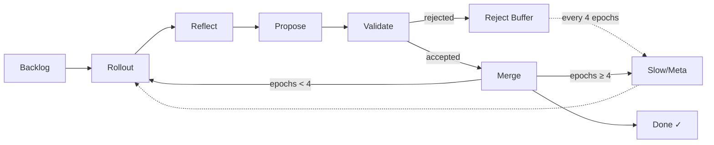

# SkillOpt — Controlled Skill Optimization for Hermes Agent

**Optimize any agent skill document using a rigorous, methodology-driven pipeline.** Inspired by Microsoft Research's SkillOpt paper (arXiv 2605.23904), which proved that text-space optimization improves agent skills across 52/52 settings — 7 models, 6 benchmarks, and 3 agent harnesses.

## The Core Problem

Most skill development relies on reading the skill to judge its quality. **This doesn't work.** The companion SkillLens paper (arXiv 2605.23899) shows that LLM judges are 46.4% worse than chance at distinguishing effective from ineffective skills by reading them.

SkillOpt's answer: **don't evaluate the text — evaluate the execution.**

## How It Works

SkillOpt uses your Hermes Agent's built-in kanban system to run a six-phase optimization pipeline:



Each phase:

| Phase | What Happens | Artifact |
|-------|-------------|----------|
| **Rollout** | Execute the skill against training tasks | N trajectory records |
| **Reflect** | Identify systematic failure patterns across rollouts | Reflection document |
| **Propose** | Generate 1-4 bounded edits to fix failures | Edit proposals |
| **Validate** | Test each edit against held-out tasks | Accept/reject with metrics |
| **Merge** | Deploy accepted edits, snapshot, increment epoch | Updated skill |
| **Slow/Meta** | Learn from the rejected-edit buffer every 4 epochs | Meta-reflection |

### The Validation-Gate Principle

Training and validation task sets MUST be distinct. Edits are only accepted if they demonstrably improve or maintain performance on unseen tasks. Current validation is multi-objective: pass/fail is the hard primary gate, then output quality, completion speed, and token efficiency are combined into a weighted score.

## Quick Start

1. **One-time install** — clone the repo into your skills directory:
   ```bash
   git clone https://github.com/magnus919/hermes-SkillOpt \
     ~/.hermes/skills/skillopt
   ```

2. **Start a conversation** with your Hermes Agent and tell it what you want:
   ```
   I want to optimize my vault-note skill using SkillOpt
   ```

   The agent loads the SkillOpt methodology, works with you to define a test suite, and orchestrates the full optimization pipeline.

## Design Philosophy

- **Methodology over implementation** — The phase design and validation-gate principle are the real deliverable. The scripts are wrappers around the methodology, not the other way around.
- **No new infrastructure** — Uses Hermes Agent's existing kanban system. No additional daemons, databases, or APIs.
- **Artifact contracts over context retention** — Each phase writes structured JSON to disk. Downstream phases read from disk, not from LLM context.
- **Model-agnostic** — Works with any LLM you'd normally use with Hermes. Skills optimized on one model transfer to others.

## Repository Structure

```
hermes-SkillOpt/
├── SKILL.md                  # The methodology document
├── README.md                 # This file
├── AGENTS.md                 # Agent session setup instructions
├── LICENSE                   # MIT
├── scripts/
│   ├── seed-board.sh         # Create kanban board + state directory
│   ├── run-phase.sh          # Execute any pipeline phase
│   └── archive-run.sh        # Finalize run and clean up
├── references/
│   ├── methodology-guide.md  # Deep rationale for every phase
│   ├── test-suite-design.md  # How to pick training/validation tasks
│   ├── artifact-formats.md   # JSON schemas for all phase outputs
│   ├── command-syntax-verification.md  # End-to-end checks for CLI examples in proposed edits
│   └── tool-bugs-during-validation.md  # How to triage tool bugs surfaced by validation
└── templates/
    ├── board.json             # Kanban board spec
    └── test-suite.json        # Test suite JSON schema
```

## Research Foundation

| Paper | Citation | Role |
|-------|----------|------|
| **SkillOpt** | Yifan Yang et al., arXiv 2605.23904 (2025) | Prescriptive — the optimization pipeline |
| **SkillLens** | Microsoft Research, arXiv 2605.23899 (2025) | Descriptive — why the methodology is necessary |

## License

MIT — see LICENSE file.
